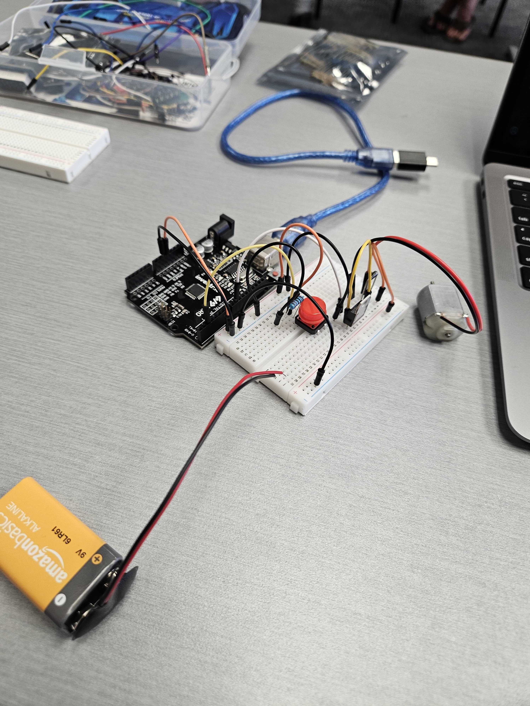

# Temperature Activated Fan With Display

This project activates a fan when the temperature exceeds 70°F. It also displays temperature readings on a 7-segment display.

---

## Components Used

| Component               | Quantity |
|------------------------|----------|
| Arduino Uno R3         | 1        |
| Breadboard             | 1        |
| Yellow LED                | 1        |
| RGB LED                | 1         |
| 220Ω Resistors          | 4        |
| TMP36 Temperature Sensor | 1      |
| DC Motor            | 1        |
| Jumper Wires           | 22      |
| 9V battery w/ connector          | 1        |
| TM1637 Seven Segment Display  | 1     |
| TIP120 Transistor             | 1  |
| Diode             | 1  |
| Push Button             | 1  |
| 10kΩ Resistor              | 1  |

---

## Installation & Setup

1. **Connect the TMP36 sensor**
   - VCC → 5V  
   - GND → GND  
   - Vout → A0
   
2. **Connect the TM1637 display**
   - VCC → 5V  
   - GND → GND  
   - DIO → 10
   - CLK → 11

3. **Connect the push button** 
   - one push button pin → 5V
   - pin next to the previous pin → Digital Pin 8 and one end of the 10kΩ resistor → other end of the resistor → GND

4. **Connect the yellow LED** 
   - LED anode (+) → Digital Pin 13  
   - LED cathode (–) → 220Ω Resistor → GND
   
5. **Connect the TIP120 transistor** 
   - Base Pin (Left) → Digital Pin 9
   - Collector Pin (Middle) → Non-striped end of Diode
   - Emitter Pin (Right) → GND

6. **Connect the Diode**
   - Striped end of the Diode → Red DC Motor wire and 9V
   - Non-striped end → Black DC Motor wire and TIP120 Collector Pin (middle)
 
7. **Connect the DC Motor**
   - Red wire → striped end of Diode
   - Black wire → non-striped end of Diode

8. **Circuit**
   - Connect a wire from one negative strip to the other negative strip, on the bread board

9. **Connect the RGB LED** 
   - Red Pin → 220Ω Resistor → Digital Pin 6  
   - Green Pin → 220Ω Resistor → Digital Pin 3  
   - Blue Pin → 220Ω Resistor → Digital Pin 5  
   - Common Cathode Pin → GND
   
10. **Connect 9V Battery** 
   - Connect the negative wire to the other negative strip on the bread board
   - Connect the positive wire to the other positive strip on the bread board

11. **Upload the Code**:
   - Open [Arduino IDE](https://www.arduino.cc/en/software/).
   - *Install the program if you don't already have it.*
   - Connect your Arduino Uno via USB.
   - Upload your `.ino` sketch.

---

## How It Works

1. The **TMP36 sensor** continuously reads the ambient temperature.
2. When the temperature is greater than **70°F**:
   - A **yellow LED** turns on, indicating that the button is ready to work.
3. When the **button is pressed**, the **DC motor (fan)** spins briefly. During the fan burst:
     - The **RGB LED turns green**.
   - When the fan stops:
     - The **RGB LED turns red**.
4. The **TM1637 display** shows the detected temperature in Fahrenheit.

---

## Images / Videos

- 
- 

---

## Simulation

> Use an online simulator like [Tinkercad](https://www.tinkercad.com/) to view or simulate the main circuit of the project.

- [Tinkercad Simulation Link](https://www.tinkercad.com/things/3U5mjMHGdw5-temperature-fan-with-display-nat?sharecode=d1k_oRAmztpzLEHx-oRXd9poU2PdSio1NQsSGfVgCGE)

> Use an online simulator like [Wokwi](https://wokwi.com/) to view or simulate how the **Seven Segment Display** gets connected to the project.

- [Wokwi Simulation Link](https://wokwi.com/projects/436555416015897601)

---

## Credits

- Project by *Nat King*
- Inspired by: Fans.
- Libraries used:
  - `Arduino.h`
  - `TM1637Display.h`

---
